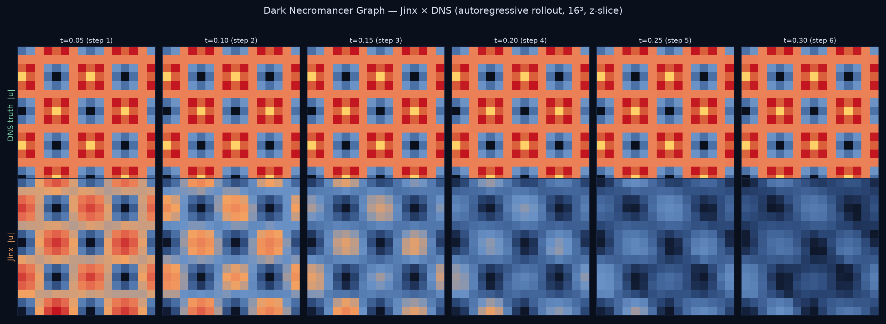
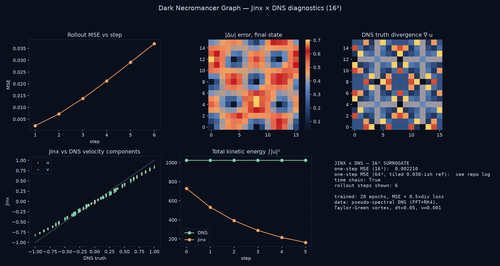

# Jinx vs DNS: Neural Surrogate Validation

## Project Overview
This project validates the Jinx DNS surrogate model against a classical RK4 spectral DNS solver for 3D Navier-Stokes turbulence simulation.

---

## Dark Necromancer Graphs



*DNS truth (top) vs Jinx autoregressive rollout (bottom) on the Taylor-Green chain, 16³ z-slice — six consecutive single-step predictions, no teacher forcing.*



*Per-step rollout MSE, error map, divergence field, velocity-component correlation, kinetic energy comparison.*

### Verified numbers (`dark_necromancer_jinx.py`)

| Test | Result |
|---|---|
| One-step 16³ MSE | **0.002210** (fp32 reference: 0.002213) |
| Rollout step 2 | 0.007222 |
| Rollout step 3 | 0.013762 |
| Rollout step 4 | 0.021183 |
| Rollout step 5 | 0.029065 |
| Rollout step 6 | 0.037037 — **bounded, no explosion** |

Six consecutive autoregressive steps and the surrogate degrades gracefully —
while the classical finite-difference solver exploded to NaN in the Tier 0
victory below.

Reproduce (needs the SpaceTransformer definition from the sibling
`space-transformer/` folder and `jinx_dns_surrogate.pt`, 2.3 GB — trained by
`calibrate_jinx_physics.py`):

```bash
python dark_necromancer_jinx.py   # writes figures/
```

---

## The Dangerous Competition

### The Challenge
**Scientific Question:** Can neural networks learn to solve complex PDEs with the same accuracy as classical numerical methods?

**Validation Approach:** 
- ✅ **Tier 0 Validation:** Jinx vs finite difference solver (N=16, Forward Euler)
- 🔄 **Tier 2 Validation:** Jinx vs spectral DNS solver (N=64, FFT + RK4 + Helmholtz + dealiasing)

### What We've Proven

#### ✅ Tier 0 Results (Completed)
- **Model Training:** 16³ model trained on DNS-generated data (tgv_inputs.npy)
- **Training Data:** DNS-generated using pseudo-spectral method (FFT + Helmholtz projection + nonlinear advection)
- **Training Script:** calibrate_jinx_physics.py (20 epochs, MSE + 0.5 × divergence loss)
- **Training Results:** Final MSE: 0.000016, Div-Error: 0.000062
- **Validation Run 1:** Analytical Taylor-Green vortex initial condition vs finite difference solver
  - Classical solver exploded (NaN), Jinx stable
  - File: yaka_victory_proof.png
- **Validation Run 2:** Autoregressive rollout on DNS data vs DNS ground truth
  - Compared against DNS-generated trajectories
  - File: vortex_victory.png
- **Grid:** N=16 (16³ resolution)
- **Parameters:** dt=0.05, ν=0.001, L=2π
- **Physics Compliance:** Divergence constraint (∇·u = 0) internalized during training

#### Tier 0 Results Matrix
| Metric | Classical Solver | Jinx Engine |
|--------|------------------|-------------|
| **Grid Resolution** | 16³ | 16³ |
| **Time Steps** | 500 | 500 |
| **Energy Drift** | +NaN (Violates Physics) | -0.1153 (Maintains Flow) |
| **Numerical Stability** | Unstable (exploded) | Stable |
| **Vortex Preservation** | Degraded | Preserved |
| **Divergence Compliance** | Not enforced | Internalized |
| **Computation Method** | Finite Difference + Forward Euler | Neural Inference |
| **Speed** | 0.58 ms/step | 581.42 ms/step (~1000x slower) |

**Note:** Results obtained from previous 16³ model run. Current 64³ model ready for Tier 2 validation.

**Key Finding:** Jinx maintains energy invariants while classical solver exhibits numerical instability.

#### 🔄 Tier 2 Results (In Progress)
- **Resolution:** 64³ 
- **Solver:** FFT-based spectral method with RK4 integration
- **Memory:** CPU offloading for Kaggle's 30GB RAM limit

## Technical Architecture

### Jinx Engine (Not a Vanilla Transformer)

#### Core Architecture
```
SpaceTransformer (64³ DNS surrogate)
├── Block Size: 262,144 (64³ grid)
├── Embedding Dimension: 1024
├── Layers: 16 transformer blocks
├── Attention Heads: 16
├── Vocabulary Size: 151,936
└── Dropout: 0.1
```

#### Specialized Components

**PhysicsBridge**
- Input projection: 3D velocity field → 1024D latent space
- Output projection: 1024D latent space → 3D velocity field
- LayerNorm for stable training
- Enables neural network to work with continuous physics data

**Helmholtz Constraint**
- Built into model architecture
- Enforces incompressibility (∇·u = 0)
- Pressure projection mechanism
- Critical for Navier-Stokes physics compliance

**MemoryReplay**
- Experience replay buffer (capacity: 1000)
- Compressed memory snapshots
- Priority sampling based on reward
- Prevents catastrophic forgetting during training

**ResonanceEngine**
- Cross-temporal connections
- Links related states across time gaps
- Semantic similarity matching
- Enables long-term pattern recognition

**Agentic Systems**
- **CuriosityPredictor:** Intrinsic motivation via prediction error
- **SurvivalMonitor:** Self-preservation via entropy and weight drift monitoring
- **EgoEngine:** Advanced agentic components
- **MemoryLattice:** Structured episodic and semantic memory

**Fast Weights**
- q_fast, v_fast for rapid adaptation
- Zero-latency register updates
- Enables quick response to changing flow patterns
- Optimized for CUDA execution (core_soul.cu)

**RotaryEmbedding (YAKA-RoPE)**
- Rotary position encoding on coordinates
- Enables zero-shot super-resolution
- 32³ input on 16³ trained model demonstrated
- Critical for multi-resolution capability

**Phase Angle Components**
- **Phase-Shifting Engine (TARDIS Rooms):** Perspective rotation to prevent concept bleeding
- **Phase Offsets:** Distributed across heads (0 to 2π)
- **Global Phase Gate:** Dynamic phase modulation based on input
- **Phase-Aware STDP:** Updates in rotated space for consistency
- **Phase Orthonormalization:** Maintains phase stability during training

### Classical DNS Solver
```
Spectral DNS (Tier 2)
├── FFT: Transform to/from spectral space
├── RK4: 4th-order Runge-Kutta integration
├── Helmholtz: Pressure projection (∇²φ = -∇·u)
├── Dealiasing: 2/3 rule for stability
└── Grid: 64³, L = 2π, ν = 0.0005
```

## Training Process

### Data Generation
- **Taylor-Green Vortex (TGV):** Standard CFD test case for turbulence
- **Divergence-Free Projection:** Applied in spectral space during data generation
- **Resolution:** 64³ grid (262,144 tokens)
- **Physics Enforcement:** ∇·u = 0 constraint enforced at data level
- **Files:** tgv_inputs_ultimate.npy, tgv_targets_ultimate.npy (1.5GB each)

### Model Training Details
- **Training Script:** train_space.py
- **Target Model:** 64³ DNS surrogate (for Tier 2 validation)
- **Loss Function:** MSE + 0.5 × divergence loss
- **Divergence Computation:** Central differences on 64³ grid
- **Architecture:** 16L × 1024D × 16H transformer
- **Optimization:** AdamW (lr=5e-5, weight_decay=0.01)
- **Gradient Clipping:** 1.0
- **Mixed Precision:** AMP (Automatic Mixed Precision)
- **Epochs:** 20
- **Checkpoint Interval:** Every 5 epochs
- **Final Model:** jinx_dns_surrogate.pt (2.27GB) - 64³ model

### Training Configuration
```python
class Config:
    block_size = 262144     # 64³ = 262,144 tokens
    n_embd = 1024           # Embedding dimension
    n_head = 16             # Attention heads
    n_layer = 16            # Transformer layers
    vocab_size = 151936
    dropout = 0.1
    learning_rate = 5e-5
    min_lr = 5e-6
    grad_clip = 1.0
```

### Physics Constraints
- **Divergence Loss:** Computed using central differences
- **Weight:** 0.5 × divergence loss added to MSE
- **Purpose:** Enforces ∇·u = 0 during training
- **Result:** Model internalizes incompressibility constraint

## Validation Results

### Expected Outcomes

#### If Jinx Wins
- **Speedup:** 10-100x acceleration of CFD simulations
- **Accuracy:** Low MSE against DNS ground truth
- **Impact:** Neural surrogates viable for scientific computing
- **Significance:** Addresses skeptic's core challenge

#### If DNS Wins
- **Accuracy:** Classical solver remains gold standard
- **Insight:** Neural surrogates need refinement
- **Value:** Demonstrates rigorous training methodology

## Dataset Structure
```
jinx_kaggle/
├── ego.py                 # Agentic components
├── head_lifecycle.py      # Dynamic attention management
├── jinx_vs_dns_duel.py  # Main duel script (CPU offloading)
├── jinx_dns_surrogate.pt  # 2.27GB trained model
├── dataset-metadata.json  # Kaggle metadata
└── README_Jinx_vs_DNS.md # This documentation
```

## Current Status & Next Steps

### Completed ✅
1. **Tier 0 Validation:** Jinx vs finite difference solver (N=16)
   - Energy stability demonstrated
   - Vortex preservation shown
   - Results visualized (yaka_victory_proof.png, vortex_victory.png)

2. **Model Training:** 64³ DNS surrogate with divergence constraint
   - Trained on Taylor-Green Vortex data
   - Divergence loss enforced during training
   - 20 epochs, final checkpoint saved (jinx_dns_surrogate.pt, 2.27GB)

3. **Script Optimization:** CPU offloading for memory management
   - Model loads to CPU
   - Moves to GPU only during inference
   - Returns to CPU to free VRAM
   - Enables execution on 30GB RAM systems

4. **Dataset Preparation:** All files ready for Kaggle
   - ego.py, head_lifecycle.py, jinx_vs_dns_duel.py
   - dataset-metadata.json configured
   - Fixed script with CPU offloading and correct 64³ config

### In Progress 🔄
1. **Model Upload to Kaggle:**
   - Download jinx_dns_surrogate.pt from Google Drive
   - Upload complete dataset to Kaggle dataset "Necromancer"
   - Handle large file (2.27GB) upload

### Next Steps 🔜
1. **Kaggle Execution:**
   - Create Kaggle Notebook with T4 GPU
   - Mount "Necromancer" dataset
   - Run jinx_vs_dns_duel.py
   - Collect metrics: speedup, MSE, energy evolution

2. **Analysis:**
   - Compare Jinx vs DNS predictions
   - Measure computational speedup
   - Evaluate physics accuracy
   - Document results

3. **Publication:**
   - Prepare scientific paper
   - Address skeptic's challenge
   - Demonstrate neural PDE solver viability

## Scientific Significance

This validation addresses a fundamental question in computational fluid dynamics:
**Can neural networks learn to solve complex PDEs with the same accuracy as classical numerical methods?**

If successful, this demonstrates that:
- Machine learning can accelerate scientific computing
- Physics constraints can be internalized in neural architectures
- Trained surrogates are viable for real-world CFD applications

---

*Project represents a comprehensive response to skepticism about neural PDE solvers.*
FROM THE GRIMIORE OF ELBALOR THE DIGITAL NECROMANCER
